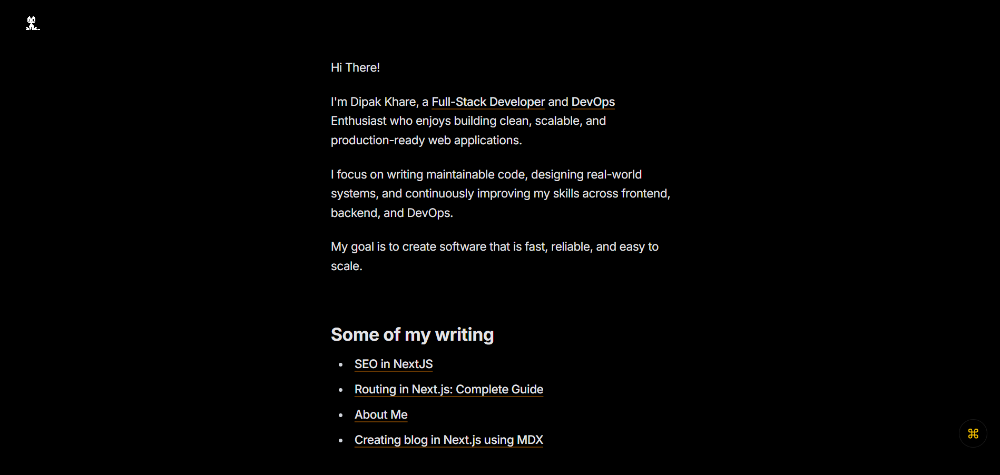

# Dip_blog
A modern developer blog where I share thoughts, DevOps experiments, 
projects, and engineering experiences.

[](https://vercel.com/new/clone?repository-url=https%3A%2F%2Fgithub.com%2FBartoszJarocki%2Fcv)
[](https://nextjs.org/)
[](https://www.typescriptlang.org/)
[](https://tailwindcss.com/)
[](https://pnpm.io/)

[](https://www.docker.com/)
[](https://opensource.org/licenses/MIT)

🌐 Live: https://dipnext.vercel.app

## 📸 Preview


### This is the bloging website where Dipak put his thoughts , innovationns, work & experince , Lessons 

## 📦 Dependencies

- **next** – React framework for server-side rendering and routing
- **react** – UI library for building user interfaces
- **react-dom** – DOM renderer for React
- **next-mdx-remote** – Render MDX content in Next.js (App Router friendly)
- **gray-matter** – Parse frontmatter metadata from MDX files
- **rehype-slug** - Automatically adds id attributes to headings for anchor links and TOC navigation
- **rehype-autolink-headings** - Wraps headings with anchor links so sections can be shared directly
- **cmdk** - Library for building a command palette (⌘K style search and navigation UI)

## ⚙️ Technologies

- **Next.js 16** – App Router–based React framework
- **React 19** – Component-based UI development
- **TypeScript** – Type-safe JavaScript
- **Tailwind CSS 4** – Utility-first CSS framework
- **PostCSS** – CSS processing tool
- **ESLint** – Code quality and linting
- **MDX** – Markdown with JSX support for blogs
- **Vercel** – Deployment and hosting platform

## Folder Structure

```ts
app/
├─ blog/
│  ├─ page.tsx                # Blog listing
│  ├─ BlogPageClient.tsx      # Client MDX renderer
│  └─ [slug]/
│  |   └─ page.tsx             # Single blog page
│  |
|  devops/ 
|    ├─ page.tsx    #Devops section
lib/
├─ blog.ts                    # FS + gray-matter helpers
│
types/
├─ blog.ts                    # Blog + Frontmatter types
├─ seo.ts                    # SEO , helper types
├─ utils.ts                    # tailwind helper & types
│
data/
└─ blog/
|   ├─ routing-in-nextjs.mdx
|   ├─ react-hooks.mdx
|   └─ docker-basics.mdx
|
.env                 # environment Variable
|
.env.local           # environment variables for local dev
|
|
robots.ts        #For web crawling
|
|
|

```
## Installation / Setup Guide
```ts
git clone https://github.com/DIPAKK2310/dip_blog.git
cd Dip_blog
npm install
npm run dev
```

## Format

```ts
npm run format
```


### .env local example

```ts

NEXT_PUBLIC_URL="https://dipnext.vercel.app/"

KV_REST_API_READ_ONLY_TOKEN="*******"
KV_REST_API_TOKEN="*******"
KV_REST_API_URL="*******"
KV_URL="*******"
REDIS_URL="*******"

UPSTASH_REDIS_REST_URL="*******"
UPSTASH_REDIS_REST_TOKEN="*******"
```


## Git Commit Guidelines

### **Want to commit follow this !**

**Commit Types**

- `feat` – new feature
- `fix` – bug fix
- `refactor` – improve code structure
- `chore` – maintenance tasks
- `remove` – delete files/code


**Examples**

```bash
feat: add product API

fix: resolve login authentication issue

refactor: remove unused functions

chore: update dependencies

remove: delete unused components
```

## Author Section

### Dipak Khare

Portfolio: https://dipnext.vercel.app  
GitHub: https://github.com/DIPAKK2310  
LinkedIn: https://linkedin.com/in/dipak-khare-159107212

### Developed and build by DK💖